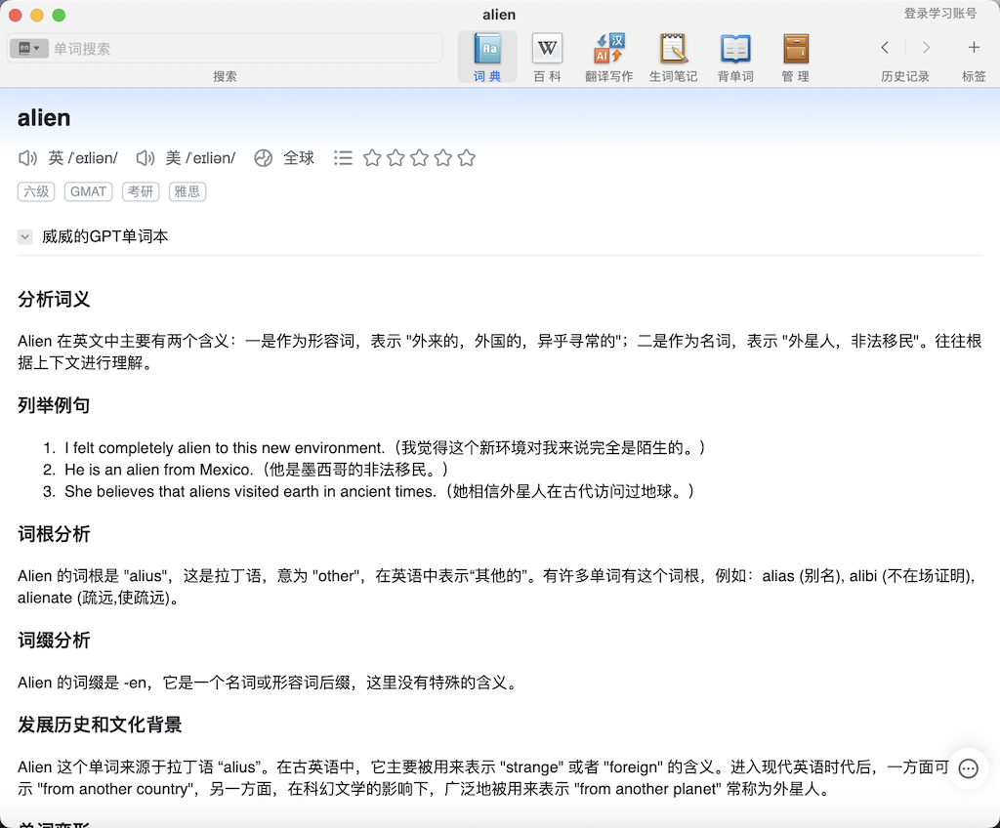
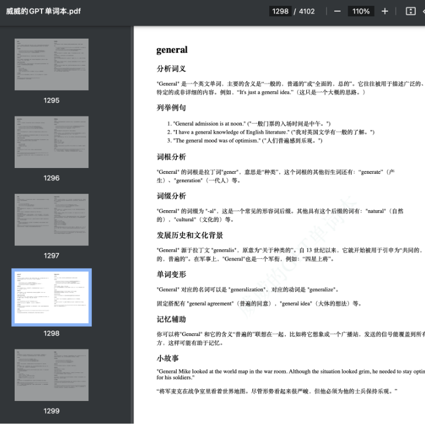
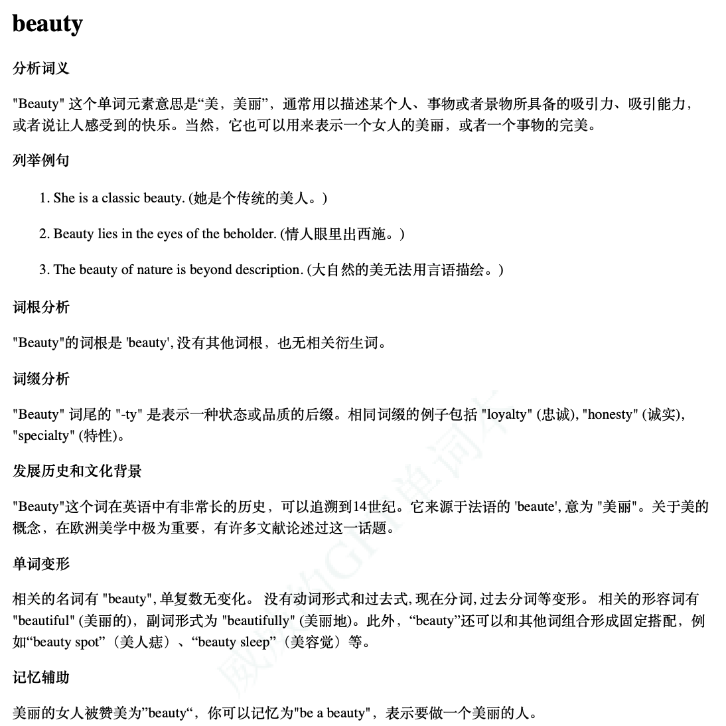
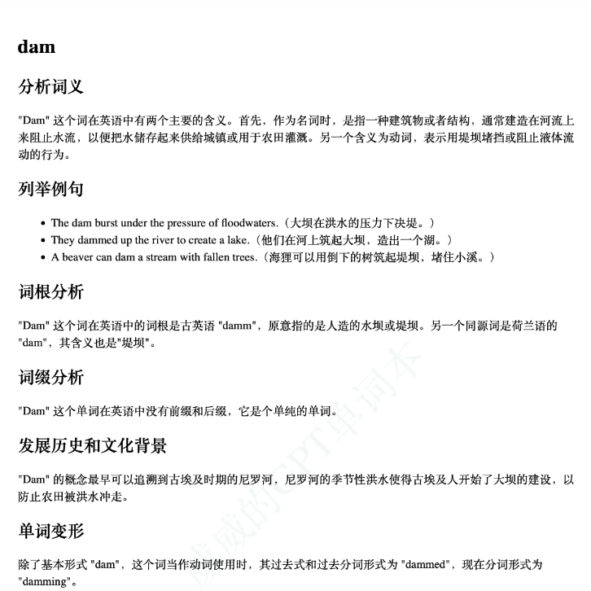
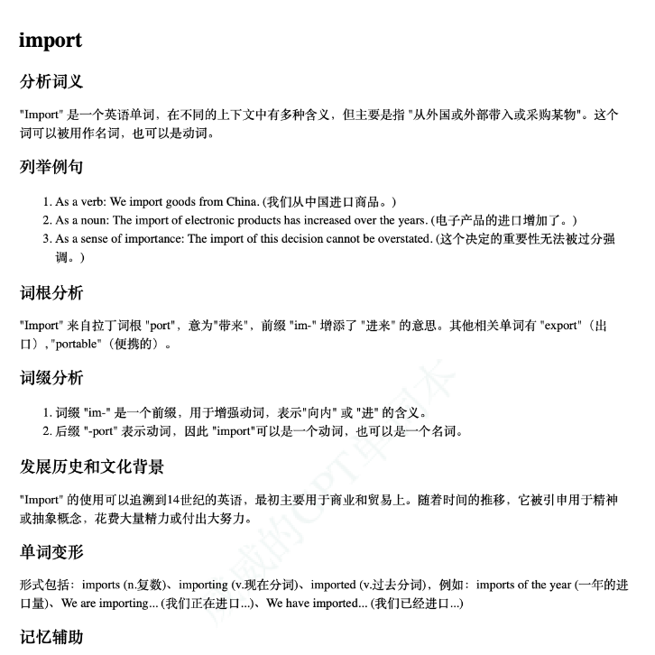
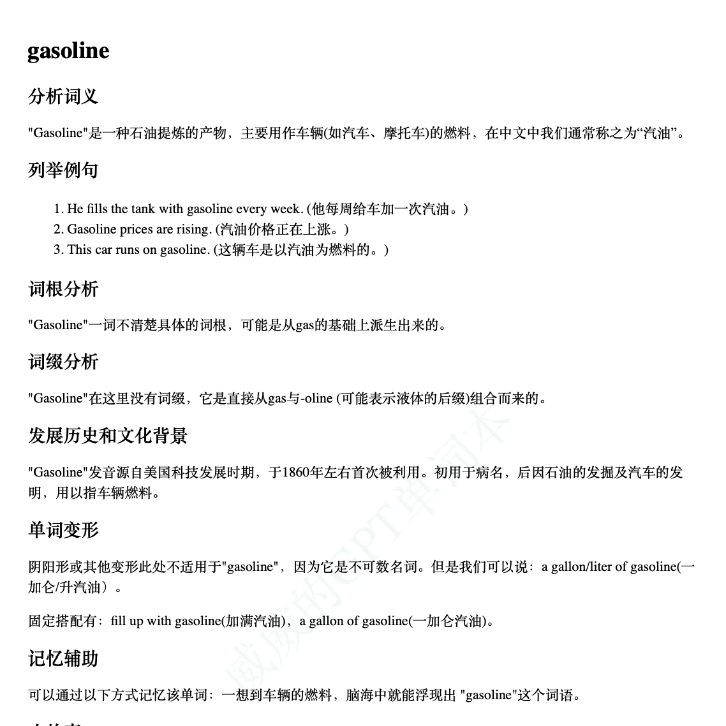

## 快速开始

- [电子书 EPUB 下载](<./威威的GPT单词本(8000词).epub>)

- [PDF 下载](<./威威的GPT单词本(8000词).pdf>)

- [在线网页](https://ceelog.github.io/DictionaryByGPT4/index.html)

- [JSON 数据](./gptwords.json)

- [MDX 词典](<./威威的GPT单词本(8000词).mdx>)



## 前言

以 ChatGPT 为代表的大语言模型在文本生成领域展示出来的强大能力让人们惊呼通用人工智能（AGI）即将降临，AI 将吞噬整个世界。

今天我们来看看 ChatGPT 在英语单词学习这个垂直领域带来的变化。


## 面临的问题

从小学开始念 ABC，到大学毕业考完 CET-4/6 级，我们学习英语的周期不可谓不长。但是由于缺乏文化背景和沉浸式的语言环境，大部分人学完考完就抛，最终只记得一些简单的词汇，说两句生硬的句子。白白浪费了大量的时间和精力，让人惋惜。

语言本质上是文化的载体和表达交流的工具。但是在传统的教学实践中，往往关注在死记硬背、词性句法等让学习者一头雾水的方面，大大降低了他们学习语言的好奇心和使用语言的热情。

举个文化背景重要性的例子：

`March` 是`三月`的意思，同时 `march` 的含义有：

> _v._ 行军;  前进;  行走;  迫使…同行
>
> _n._ 行进;  进步;  进行曲

不知道为什么三月份用 March，也不知道和行军前进有啥关系。但是如果你了解西方历史文化，那么一切都变得清晰起来：

> 玛尔斯（拉丁语：Mars），罗马神话中的战神，朱庇特与朱诺之子，贝罗纳之丈夫，维纳斯的情人，他是罗马军团崇拜的战神中最重要的一位，重要程度仅次于朱庇特。
>
> "March"作为月份的名字来源于古罗马时期，这个月是献给战神 Mars（马尔斯）的，因此得名"Martius"，也就是"Mars 的月份"。
>
> 在罗马历法中，March 是年中的第一个月份。这在后来被现代格里历法规定为一年里的第三个月。

用战争之神命名月份，并衍生到行军前进也很符合语言演化的逻辑，所以这个单词理解记忆起来也就简单多了。

## AI 新变量

大语言模型的出现将彻底解决当前语言学习的问题。

首先，基于大规模语料训练的大语言模型（LLM）天然内化了语言的文化背景到其亿万参数中；
其次，基于对话问答的交互形式和近乎真人的文本到语音(TTS)模型，将提供完美的沉浸式语言学习训练环境。

看看这个单词解析的示例：

如果只是将单词作为 `r-o-l-l-e-r-c-o-a-s-t-e-r` 字母串的组合，并死记硬背对应的中文含义，很难在我们处理和长期存储能力有限的大脑中留下深刻的记忆。结果事倍功半，出力不讨好，更糟糕的是会将我们的好奇心和热情耗尽，将本是一件有趣的事情变成厌恶。

我们也没有足够的资源，让一对一的专业老师在身边随时随地指导学习并纠正问题。

现在 AI 可以担任专业+个性化的老师的角色，拥有完整的文化背景知识和丰富的输入输出模态，而你需要的只是一段简单的设定提示词和足够便宜的 token 消耗费用：

```markdown
# 角色

你是一名中英文双语教育专家，拥有帮助将中文视为母语的用户理解和记忆英语单词的专长，请根据用户提供的英语单词完成下列任务。

## 任务

### 分析词义

- 系统地分析用户提供的英文单词，并以简单易懂的方式解答；

### 列举例句

- 根据所需，为该单词提供至少 3 个不同场景下的使用方法和例句。并且附上中文翻译，以帮助用户更深入地理解单词意义。

### 词根分析

- 分析并展示单词的词根；
- 列出由词根衍生出来的其他单词；

### 词缀分析

- 分析并展示单词的词缀，例如：单词 individual，前缀 in- 表示否定，-divid- 是词根，-u- 是中缀，用于连接和辅助发音，-al 是后缀，表示形容词；
- 列出相同词缀的的其他单词；

### 发展历史和文化背景

- 详细介绍单词的造词来源和发展历史，以及在欧美文化中的内涵

### 单词变形

- 列出单词对应的名词、单复数、动词、不同时态、形容词、副词等的变形以及对应的中文翻译。
- 列出单词对应的固定搭配、组词以及对应的中文翻译。

### 记忆辅助

- 提供一些高效的记忆技巧和窍门，以更好地记住英文单词。

### 小故事

- 用英文撰写一个有画面感的场景故事，包含用户提供的单词。
- 要求使用简单的词汇，100 个单词以内。
- 英文故事后面附带对应的中文翻译。
```

## GPT 单词本

基于这套提示词，通过 GPT-4 接口，将涵盖中考、高考、大学四六级的超过 8000 个单词全部分析一遍，最终产出了 GPT 单词本：


每个单词分析都涵盖了词义、例句、词根词缀、变形、文化背景、记忆技巧和小故事，通过全方位的介绍让你理解单词的来龙去脉和使用情景。

## 结语

语言本质上是文化载体和表达交流的工具。所以学习语言最好的方式就是在熟悉其文化背景的基础上自由沉浸地沟通表达（包括口头和书面形式）。

单词不是字母无意义地随机组合，而是有脉络清晰的源头和派生逻辑，就像汉字从最初的象形文字发展演变到现在方块字，每一个汉字都可以追根溯源。

希望这份 GPT 单词本可以帮你快速提高词汇量，将英语能力提升到更高水平。

如果你也在利用 ChatGPT 学习英语，欢迎扫码进群 ，交流一下使用技巧和实践效果:


## 附录







